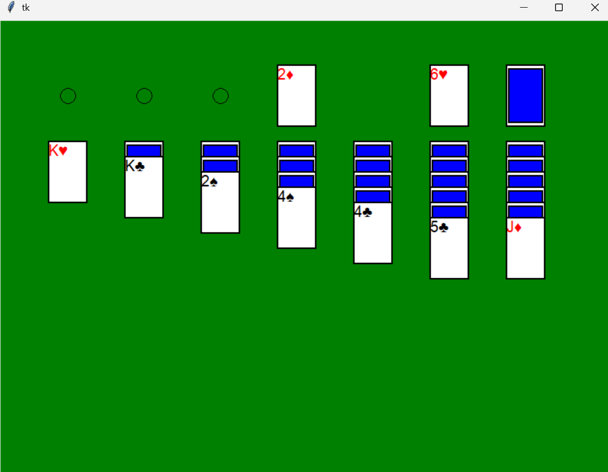
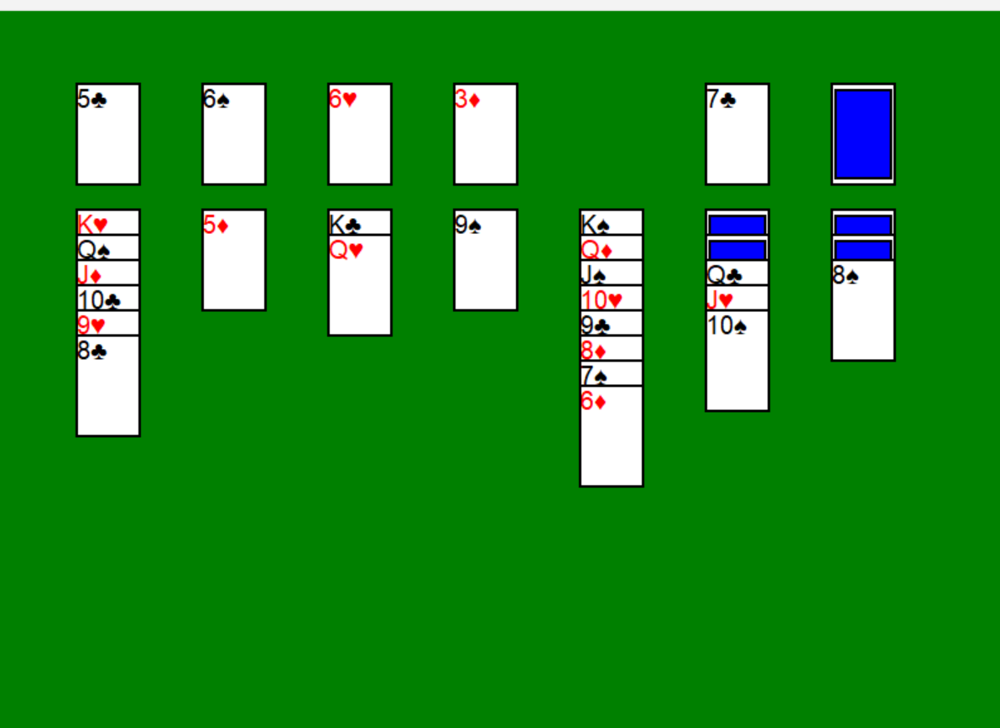
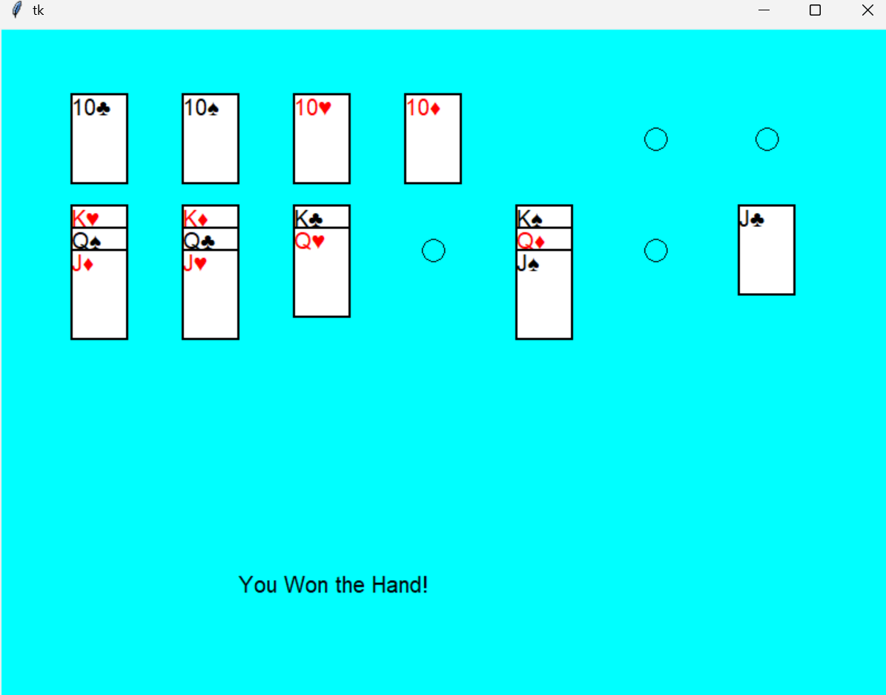

[py-solitaire-README.md](https://github.com/user-attachments/files/30678550/py-solitaire-README.md)
# py-solitaire

Klondike solitaire, built from scratch in Python.

## Screenshots

### New Game



### Mid Game


### Win Screen


## About

A full implementation of Klondike solitaire — card dealing, tableau and foundation piles, stock and waste, and the move-validation rules that make the game actually playable rather than just a card display.

Written as an exercise in game state modeling: solitaire looks simple, but the rules around what can move where (alternating colors, descending ranks, king-only empty columns, foundation ordering) make for a genuinely interesting state-management problem.

## Running it

```bash
git clone https://github.com/AaronJames95/py-solitaire.git
cd py-solitaire
python main.py
```

## How it works

- Card and deck representation with shuffling and dealing
- Tableau, foundation, stock, and waste pile management
- Move validation enforcing Klondike rules
- Win-condition detection

## Stack

Python (standard library)

---

Built by [Aaron Collins](https://github.com/AaronJames95). Available for contract work — [ajcollin@alumni.cmu.edu](mailto:ajcollin@alumni.cmu.edu)
